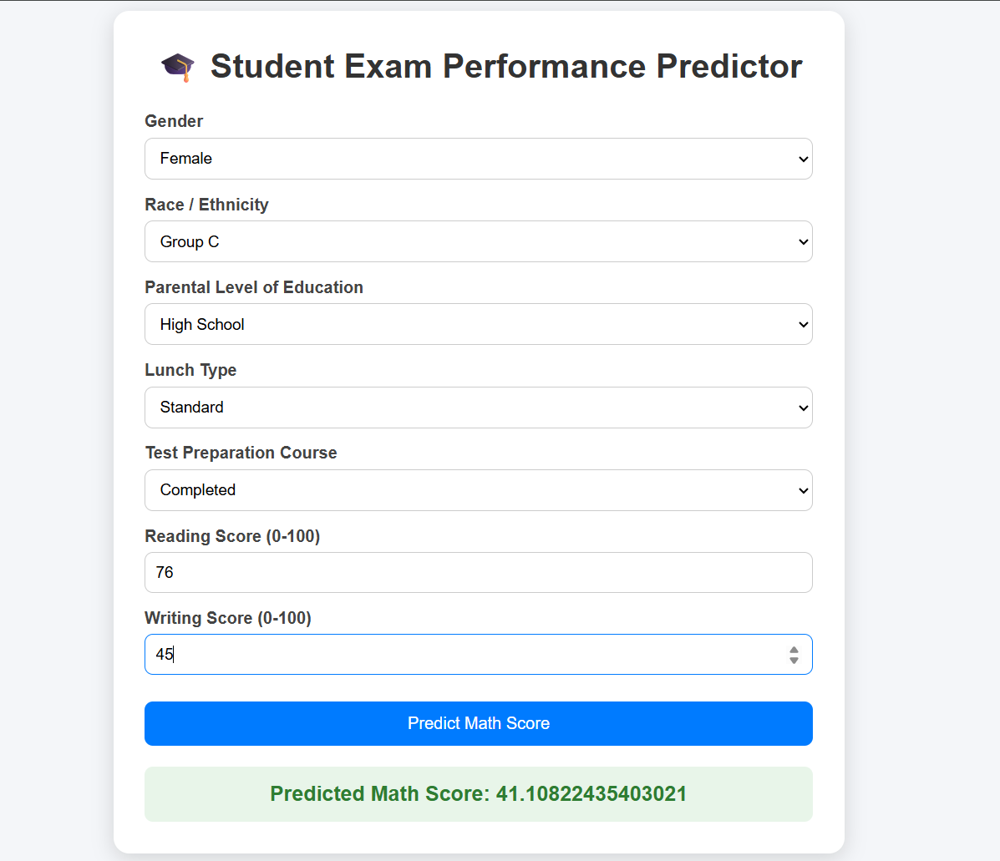

# Student Performance Prediction ML Project

## Project Overview
This project predicts a student's Math Score based on various demographic and academic factors such as gender, race/ethnicity, parental education level, lunch type, test preparation course, reading score, and writing score.

The project follows a complete Machine Learning lifecycle including data ingestion, data transformation, model training, model evaluation, and deployment using Flask.

## Problem Statement

Educational institutions can use predictive analytics to identify students who may require additional academic support.

The objective of this project is to predict a student's Math Score using other available student-related attributes.

## Dataset Features

Student Performance Dataset from Kaggle.

Features include demographic details, parental education, lunch type, test preparation course, reading score, writing score, and math score.

### Input Features

- Gender
- Race/Ethnicity
- Parental Level of Education
- Lunch Type
- Test Preparation Course
- Reading Score
- Writing Score

### Target Feature

- Math Score

## Technologies Used

- Python
- Pandas
- NumPy
- Scikit-Learn
- CatBoost
- Flask
- HTML

## Project Structure

```text
Student-Performance-Prediction/
│
├── artifacts/
├── notebook/
├── src/
│   ├── components/
│   ├── pipeline/
│   ├── exception.py
│   ├── logger.py
│
├── templates/
├── app.py
├── requirements.txt
├── README.md
└── setup.py
```

## Machine Learning Workflow

1. Data Ingestion
2. Data Cleaning
3. Exploratory Data Analysis
4. Feature Engineering
5. Data Transformation
6. Model Training
7. Model Evaluation
8. Model Selection
9. Prediction Pipeline
10. Flask Deployment

## Models Evaluated

- Linear Regression
- Decision Tree Regressor
- Random Forest Regressor
- CatBoost Regressor
- XGBoost Regressor

The best-performing model was selected and saved for deployment.

## Evaluation Metrics

- R² Score
- Mean Absolute Error (MAE)
- Mean Squared Error (MSE)
- Root Mean Squared Error (RMSE)

## Web Application

The project includes a Flask-based web application where users can:

- Enter student details
- Submit the form
- Receive predicted Math Score instantly

## Installation

Clone the repository:

```bash
git clone https://github.com/anjalimali2312/Student-Performance-Prediction.git
```


Install dependencies:

```bash
pip install -r requirements.txt
```

Run the application:

```bash
python app.py
```

Open:

```text
http://127.0.0.1:5000/predictdata
```
## Application Screenshots



## Author

Anjali Mali
Machine Learning Enthusiast 